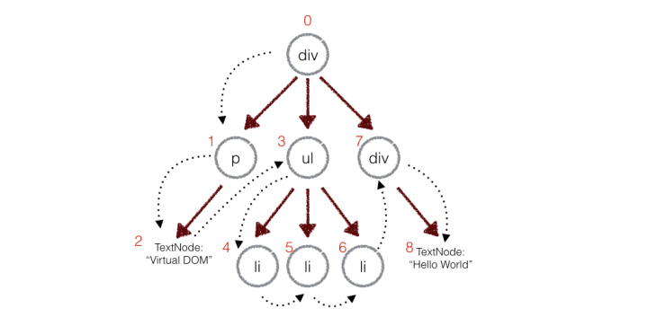

# Virtual DOM 

1. 用 javaScript 对象模拟 Virtual DOM 树
  用 JavaScript 对象模拟 Virtual DOM 树很简单，只需要记录 TagName, Props, 以及 Children 就可以了
    ```javascript
    function Element (tagName, props, children) {
      this.tagName = tagName
      this.props = props
      this.children = children
    }

    module.exports = function (tagName, props, children) {
      return new Element(tagName, props, children)
    }
    ``` 
1. render 方法会根据 TagName 构建一个真正的 dom 结构，然后把 Props 设置上去，然后递归的把自己的子节点也构建出来
1. 当 setState 触发以后，会再次构建一个新的 Virtual DOM 树，然后与旧的进行 diff，生成对应的 patches
   - 两个 Virtual DOM 树完全的 diff 是一个时间复杂度为 O(n^3) 的问题，但是很少会有将一个节点进行跨级的移动 dom，所以 react 只会对同一级别的 Virtual DOM 进行对比，这样时间复杂度就变成了 O(n)
   - 在 diff 操作时，react 会遵循 `深度优先` 的原则，先从顶部开始进行对比，然后第一个子节点，然后再子节点的子节点，依次执行
   
     
     
   - 在深度优先的前提下，每遍历一个节点，如果有当前节点有差异，就将该差异以 object 的形式记录到 patches 数组中
   - 差异类型：replace，移动删除新增[列表对比]，props, text
   - 列表对比会记录对当前列表中的操作，通过 key 值来唯一区分到底是哪一个 item，之所以用 key 是因为 TagName 在有些情况下是一样的
1. 把差异应用到真实的 dom 树上： 根据前一个 Virtual DOM 以及 diff 出来的 patches，将真实的 dom 更新，然后刷新 Virtual DOM，这样就完成了更新

1. 结语
    - 构建虚拟 DOM                   --       完成的回调 componentWillMount
    - 通过虚拟 DOM 构建真实的 DOM     --       完成的回调 componentDidMount
    - 生成新的虚拟 DOM               --       触发条件   setState
    - 比较两颗树的不同                ---      完成的回调 render
    - 在真正的 DOM 树上进行变更
