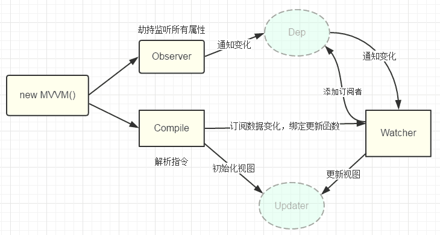

[来源](https://segmentfault.com/a/1190000006599500)

# vue 原理 - 数据劫持以及发布者-订阅者模式

## Observer

能够对数据对象的所有属性进行监听，如有变动可拿到最新值并通知订阅者
Object.DefineProperty() 中定义了 setter 和 getter, 每当数据发生变化，就会触发 setter，这时 Observer 就通知订阅者 Watcher

## Watcher

作为连接 Observer 和 Compile 的桥梁，能够订阅并收到每个属性的变动通知，执行指令绑定的相应回调函数，从而更新视图
1. 在自身实例化时往属性订阅器（dep）里面添加自己
2. 自身必须有一个 update() 方法
3. 待属性变动 dep.notice() 通知时，能调用自身的 update() 方法，并触发 Compile 中绑定的回调

## Compile

主要做的事情是解析模板指令，将模板中的变量替换成数据，然后初始化渲染页面视图，并将每个指令对应的节点绑定更新函数，添加监听数据的订阅者，一旦数据有变动，收到通知，更新视图。

